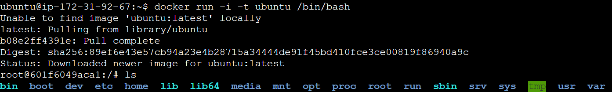

# Docker Commands

Some of the most commonly used docker commands are 

### docker images

Lists docker images on the host machine.

### docker build

Builds image from Dockerfile.

### docker run

Runs a Docker container. 

There are many arguments which you can pass to this command for example,

`docker run -d` -> Run container in background and print container ID
`docker run -p` -> Port mapping

use `docker run --help` to look into more arguments.

### docker ps

Lists running containers on the host machine.

### docker stop

Stops running container.

### docker start

Starts a stopped container.

### docker rm

Removes a stopped container.

### docker rmi

Removes an image from the host machine.

### docker pull

Downloads an image from the configured registry.

### docker push

Uploads an image to the configured registry.

### docker exec

Run a command in a running container.

### Docker starts the container and executes /bin/bash. Because the container is running interactively and attached to your terminal (due to the -i and -t flags), you can provide input using your keyboard while Docker logs the output to your terminal

docker run -i -t ubuntu /bin/bash

### docker network

Manage Docker networks such as creating and removing networks, and connecting containers to networks.

### Publishing and Exposing Ports
Creates bridge between the isolated environment of the container and outside of the world

Links a specific port on the container to a port on the host machie

enable external access to the service running inside the container

docker run -d -p 8080:80 docker/welcome-to-docker

